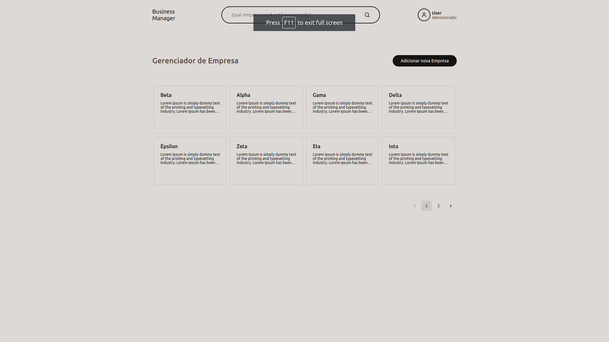

<h1 align="center">
  Business Manager Monorepo
</h1>

## Demo

<div align="center">
  
</div>

### Features

- Display a list of companies.
- Display more information about a company.
- Edit a company's information and save on Postgress database.
- Search (by name) for companies.
- Paginate companies on Home Page.

## Getting Started

### Requirements

- Node.js
- Yarn
- Docker
- Docker Compose

#### Run installation & tests

> Installs the project dependencies and runs the tests.

```
yarn
cd packages/backend
yarn test
```

#### Run installation & development mode (Docker Compose)

> Installs the project dependencies and runs the application in development mode.

```
yarn
docker-compose up --build
```

> Frontend: http://localhost:3000
>
> Backend: http://localhost:8080

## Project Design

### Dependencies

- <b>Node.js</b>.
- <b>ReactJS</b>.
- <b>TypeORM with Postgres</b>.
- <b>TypeScript</b>.
- <b>Jest</b>.
- <b>ESLint, Prettier, Stylelint</b> - It significantly increases the quality and readability of the code.
- <b>Commitlint</b> - Conventional Commits.
- <b>Husky, Lint-Staged</b> - Increases the quality of commits by running the test, ESLint and Prettier.

### Patterns

- <b>TDD</b>.
- <b>Single Responsibility</b>.
- <b>Dependency Injection</b> - Mainly to make the components more testable.
